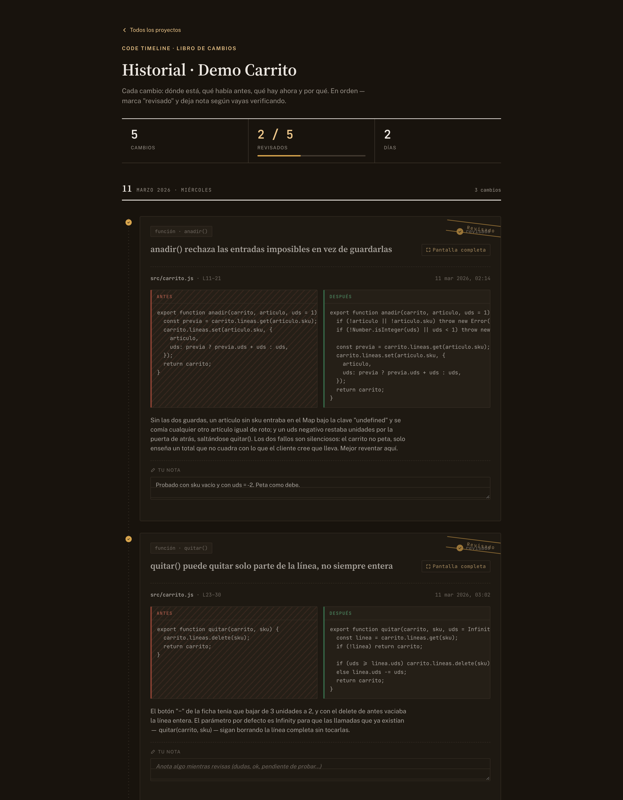
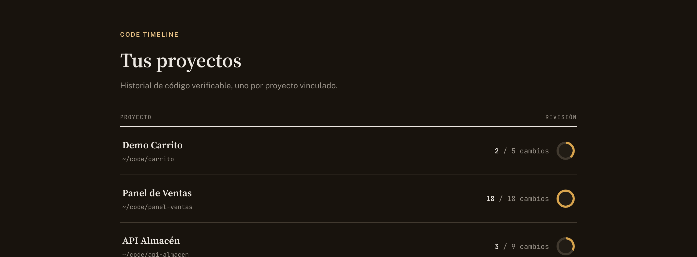
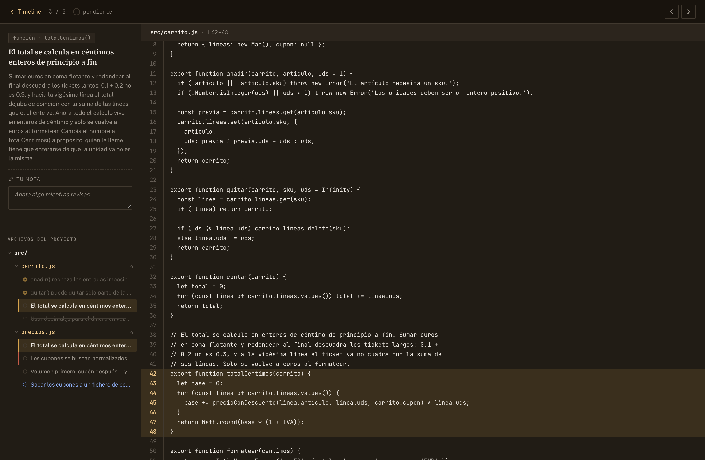
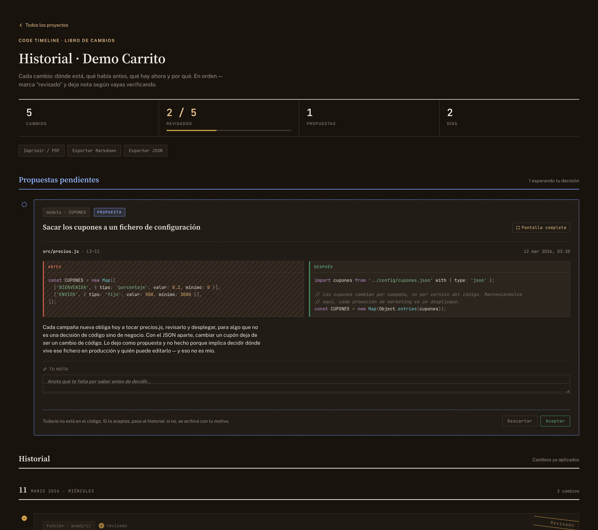
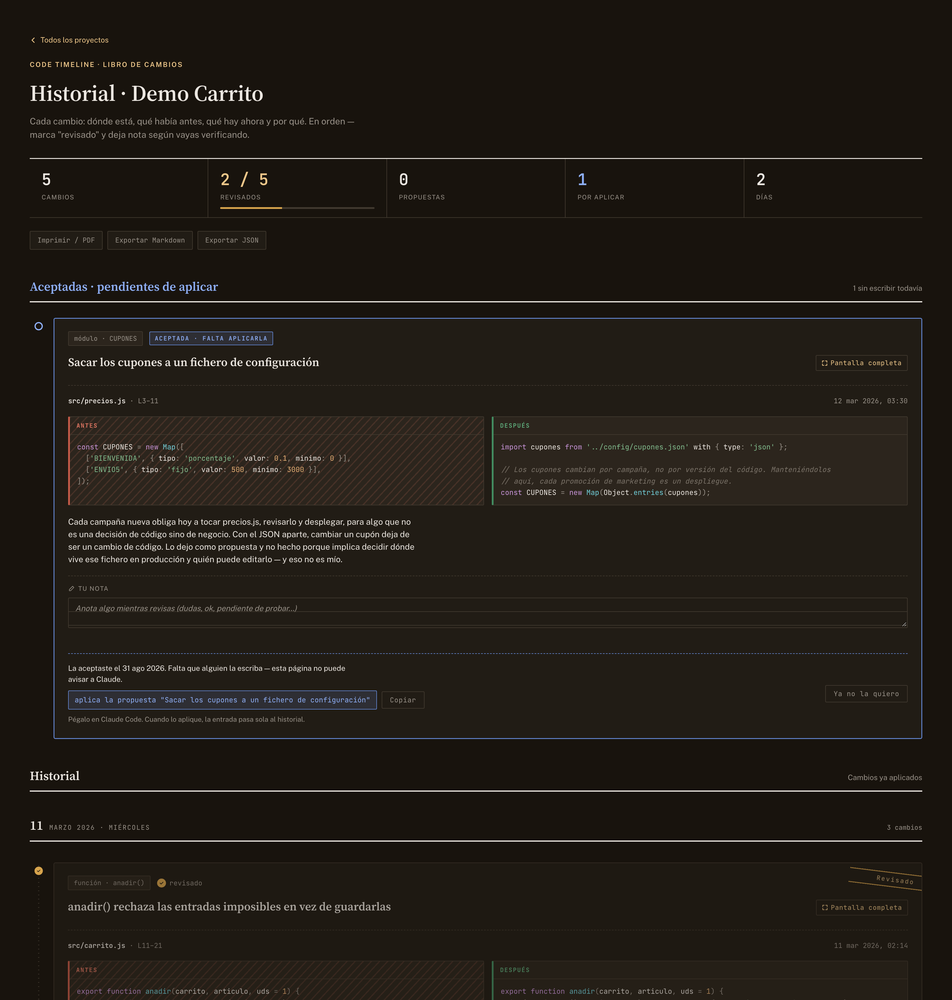
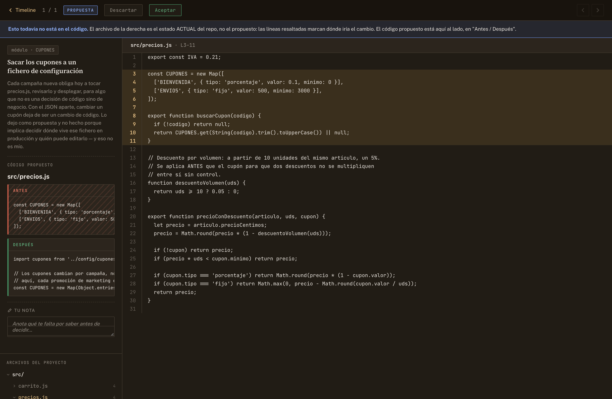

# Code Timeline

[](https://github.com/FlEtsv/code-timeline/actions/workflows/ci.yml)
[](https://nodejs.org)
[](LICENSE)

Un libro de cambios de tu código, en el orden en que se hicieron y con el
porqué de cada uno. Claude Code registra cada cambio mientras trabaja —
el método o la función que tocó, en qué archivos, el antes y el después, y la
razón— y tú lo revisas después uno a uno, marcando lo que ya has verificado.

También puede **proponer** cambios que no ha hecho: aparecen aparte, y tú los
aceptas o los descartas. Lo hecho y lo sugerido nunca se mezclan.

Todo corre en tu máquina: un servidor MCP para que Claude escriba, y una web
local en `localhost` para que tú leas. Nada se publica en ninguna parte — la
web escucha solo en `127.0.0.1`, así que ni siquiera se ve desde otro equipo
de tu red salvo que lo pidas tú con `--host`. El historial se exporta a JSON
(respaldo y traslado), a Markdown y a PDF.



La página abre por **Pendiente**: lo que reclama algo tuyo — propuestas por
decidir, aceptadas por escribir, cambios por revisar y pruebas en rojo. El
libro completo vive en la pestaña **Historial**, y las propuestas descartadas
en la suya. Imprimir saca las tres, esté abierta la que esté: una pestaña es
un estado de pantalla, no del documento.

## Lo que cuesta: +1% de tokens

Una herramienta que se mete entre tú y tu agente tiene que responder a esto
antes que a nada. Medido sobre **19 sesiones reales de Claude Code** y 7,8
millones de tokens de trabajo:

| Si una sesión sin Code Timeline es | 100% |
|---|---|
| Con Code Timeline | **100,98%** |

**Un 1% de sobrecoste.** Y no es un 1% que pagues a cambio de nada: en la misma
sesión, redactar el mensaje de commit desde el historial en vez de leyéndose el
diff ahorró **35.869 → 1.259 tokens** (un 96%). En una sesión de trabajo normal,
esto se paga solo.

### Cómo se consigue

**No te quitamos funcionalidad para que salga barato. Al revés: cada versión
añade, y encima cuesta menos.** Tres decisiones:

1. **El código no lo escribe el agente.** El `before`/`after` era el 59% de todo
   lo que se tecleaba por MCP — código que ya estaba en el disco y en git. Ahora
   `add_change` solo necesita la ruta del archivo y el fragmento se captura de
   `git diff` (`lib/captura.mjs`): exacto, acotado y gratis.
2. **Leer el historial no arrastra el código.** `list_changes` devuelve título,
   porqué, archivos y estado; `get_change` trae una entrada entera cuando la
   necesitas.
3. **Nada de relleno.** Las respuestas van en JSON compacto (la indentación era
   un 12% de puros espacios), `add_change` confirma en vez de repetirte lo que
   acabas de escribir, y cualquier herramienta acepta la ruta del repo en lugar
   del id, para que no tengas que llamar a `list_projects` antes.

Lo que queda son ~440 tokens por entrada, de los que **411 son la explicación**:
el porqué del cambio. Eso no se puede capturar de ningún sitio, porque no está
en el código — y es lo único que separa esto de un `git log`. **Lo único que
sigues pagando es exactamente lo que compras.**

### La medida, reproducible

`node --test test/coste.test.mjs` la rehace en tu máquina. No son estimaciones
de marketing: son pruebas que **fallan** si alguien encarece la herramienta sin
darse cuenta.

```
escenario                          REGISTRAR                 COMMITEAR
                        antes   ahora  ahorro      diff historial ahorro
────────────────────────────────────────────────────────────
Un cambio suelto (1)      785     443     44%       258       425   +65%
Una tanda normal (3)     2355    1329     44%       775       449    42%
Una sesión larga (8)     6280    3544     44%      2066       495    76%
```

Y lo que no vas a leer en el README de nadie: **con un cambio suelto, redactar
el commit desde el historial sale más caro que leerse el diff** (+65%). El
ahorro llega cuando el diff crece, que es justo cuando escribir el commit a mano
duele. Registrar, en cambio, ahorra un 44% siempre.

## Por qué, si ya existe `git log`

No lo sustituye, lo complementa. Un commit agrupa varios cambios de una
sentada y su mensaje cuenta el resultado, no el razonamiento. Aquí cada
entrada es **una unidad revisable**: se entiende y se verifica de una vez, sin
tener que reconstruir de qué iba.

Y hay una diferencia que en la práctica pesa más que ninguna: `git log` te dice
qué cambió, no **por qué** ni **qué se rompía antes**. Cuando el que escribe el
código es un agente, eso es justo lo que necesitas para poder revisarlo. Cada
entrada lleva la explicación que el agente redactó *mientras* hacía el cambio,
con el contexto todavía en la mano.

Cuando un cambio no tiene nada que ver con el anterior, se marca como **salto**
y hay que explicar por qué se cambió de tema. Al leer el historial seguido, eso
es lo que evita perder el hilo.

## Cómo se ve

### El índice de proyectos

Cuántos cambios lleva cada uno y cuántos has revisado ya.



### La vista a pantalla completa

El archivo **entero** leído del disco en vivo, con las líneas del cambio
resaltadas, un árbol de los archivos del proyecto a la izquierda (con qué
cambio tocó cada uno y si está revisado) y navegación anterior/siguiente para
recorrer el historial sin volver atrás.



### Propuestas

Claude también puede sugerir sin tocar nada (`propose_change`). Una propuesta
va **arriba, fuera del hilo cronológico**, con borde discontinuo: es lo único
de la página que te pide una decisión. El historial de abajo es cosa hecha.



Aceptarla **no** la mete en el historial: la deja en *aceptada, pendiente de
aplicar*. El historial dice lo que está en el código, y al aceptar todavía no
lo está — nadie la ha escrito. Entra cuando quien la escribe lo confirma con
`mark_applied`, y entonces vuelve a "pendiente de revisar" como cualquier otro
cambio.

Descartarla la archiva con tu motivo, no la borra: saber qué se rechazó y por
qué es lo que evita volver a proponerlo dentro de tres semanas.

### Cómo se entera Claude de que aceptaste

**La web no puede avisarle** — es una página en tu `localhost`, no tiene por
dónde llamarle. Así que el traspaso es explícito por los dos lados:

- La tarjeta aceptada te da la orden ya escrita y un botón para copiarla:
  `aplica la propuesta "..."`. La pegas en Claude Code y listo.
- Claude puede verlo por su cuenta con `list_proposals` y `status: "accepted"`.
  El `CLAUDE.md` del repo le dice que lo mire al ponerse a trabajar, así que
  normalmente lo saca él solo sin que se lo pidas.



Una propuesta tiene una trampa que la vista completa avisa explícitamente: el
archivo que se lee del disco es el **estado actual**, no el propuesto. Las
líneas resaltadas marcan dónde iría, y el código propuesto va al lado.



### Cómo sabes que un cambio funciona

Revisar y probar no son lo mismo, y el historial los guarda por separado:
**revisado** es que lo has leído; **prueba** es que algo lo ha ejecutado. Un
cambio puede estar revisado y sin probar, y saber cuál de las dos falta es la
mitad de la pregunta al mirar un historial ajeno.

Cada entrada lleva su estado de prueba — *sin probar*, *prueba automática*
(con el comando que la repite), *probado a mano* (con cómo), o **falla**. Ese
último existe a propósito: un historial donde solo cabe lo que funciona miente
por omisión, y el contador de arriba se pone en rojo mientras haya alguno.

```bash
code-timeline test <projectId> <changeId> --status auto --command "npm test -- carrito"
```

Claude lo registra con `set_test` cuando escribe o ejecuta la prueba.

### Estado de QA de un arnés externo

Si usas un arnés de QA (qabot o el que sea), puede dejar constancia de sus
ejecuciones sin ensuciar el historial:

```bash
code-timeline qa --resultado verde|rojo [--comando "qabot ciclo"] [--entorno staging] [--detalle "..."]
code-timeline qa --listar [--limit N]     # las últimas ejecuciones registradas
```

Se guardan **aparte**, como estado del proyecto, y se ven en una tira sobre el
historial. No son entradas: una entrada es una decisión de código con su
porqué, y meter "batería verde en staging" cada vez lo llenaría de ruido hasta
que dejara de poder leerse.

Está pensado para llamarlo desde otro script: resuelve el proyecto por la ruta
del repo — el directorio actual, o el que le digas con `--repo`, sin que haga
falta saber el `projectId` — y, **si el repo no está vinculado, no hace nada y
sale con 0**. Así quien lo invoque no depende de que
Code Timeline esté instalado ni se le rompe el ciclo si falta.

### El copiloto de git

Code Timeline sabe algo que `git` no sabe: el **porqué** de cada cambio,
escrito cuando estaba fresco. Con eso puede aconsejar sobre git de una forma
que un diff no permite.

En la cabecera de cada proyecto aparece un panel con la rama, el estado del
árbol y lo que convendría hacer:

- **Conviene un commit** — con el mensaje **redactado desde las entradas**, no
  adivinado del diff: el asunto sale del título y el cuerpo del motivo que
  registraste. Botón para copiar el `git commit` entero.
- **Esto son N commits, no uno** — cuando entre las entradas sin commitear hay
  un `jump`, que es literalmente un cambio de contexto declarado por quien lo
  escribió. Ofrece abrir una rama para lo nuevo.
- **N entradas sin commitear sobre `main`** — una tanda larga en la rama
  principal es difícil de revisar y de deshacer.
- **Pruebas en rojo a punto de entrar en git**, commits **sin subir**, y
  entradas **ya commiteadas sin su commit apuntado** (que se arreglan con
  `stamp_commits` o `code-timeline sellar`).
- **Deriva**: entradas cuyo código ya no se reconoce en el archivo — se
  revirtió o se reescribió sin registrarlo. Un historial donde solo consta lo
  que sigue vivo miente por omisión.

Todo son **consejos con el comando escrito para copiar**. Nada de esto ejecuta
git: ni commit, ni checkout, ni push. El repo lo mueve quien lo entiende.

El mismo copiloto habla por tres bocas más: la herramienta MCP `git_advice`
—para que Claude te lo diga mientras trabajáis—, el hook `Stop` que avisa una
vez por sesión, y `code-timeline consejo` en la terminal.

### Los botones que hacen cosas

La web dejó de ser solo de lectura. Tres acciones, y todas parten de un clic
tuyo:

- **Que la aplique Claude** en una propuesta aceptada. Hasta ahora esa tarjeta
  te daba una orden para copiar al terminal porque "esta página no puede avisar
  a Claude"; ahora lanza `claude -p` en el repo con el contexto de la propuesta
  ya compuesto. Cuando termina, la entrada pasa sola al historial.
- **Hacerlo** junto al consejo de commit, que ejecuta el `git commit` con el
  mensaje redactado desde tu historial. Este no pasa por Claude: el mensaje ya
  está escrito y ejecutarlo son dos órdenes de git.
- **Subir**, para los commits que se quedaron en tu máquina.

Lo que le llega a Claude desde la web es **solo una propuesta que tú has
aceptado**. No hay campo de texto libre, y es deliberado: el prompt lo compone
la herramienta a partir de algo ya escrito y revisado.

Como ese puerto puede ahora tocar tu máquina, las rutas que escriben piden un
**token** que el servidor genera al arrancar y que viaja dentro de la página,
más una comprobación de `Origin`. Una web cualquiera que visites puede hacer
que tu navegador dispare una petición contra tu localhost, pero no puede leer
la página para sacar el token.

### El cuerpo de un PR

`pr_body`, el enlace **Cuerpo de PR** de la web o `code-timeline pr` redactan
en Markdown **qué cambia, por qué y cómo se ha probado** con las entradas de
la rama actual, y avisan de lo que no debería fusionarse a ciegas —pruebas en
rojo, cambios sin revisar—. Sirve igual para la descripción de un pull request
que para el comentario de handoff al cerrar la jornada.

Tampoco publica nada: devuelve el texto. Esta herramienta no habla con la API
de GitHub ni guarda credenciales.

### Exportar

El botón **Imprimir / PDF** abre el diálogo del navegador sobre una versión
para papel: A4, tema claro, el código envuelto en vez de recortado, sin
botones y con los paneles apilados para que quepan.


Además, **JSON** y **Markdown**, desde la web, el CLI o el MCP. El JSON es el
formato de respaldo y de traslado — `import_project` lo vuelve a montar en
otra máquina, y al fusionar compara por id, así que reimportar el mismo
fichero dos veces no duplica nada. Como `data/` no se versiona, esto es lo
único que hay entre tú y perder tus notas de revisión.

## Junto a qabot

[qabot](https://github.com/FlEtsv/qabot) es un arnés de QA y despliegue con su
propio servidor MCP. Los dos juntos cierran un ciclo: **decides, se registra,
se prueba, se despliega, y el resultado vuelve al historial.**

```
Claude / Codex ──> propone y registra ──> Code Timeline   (qué cambió y por qué)
       │
       └────────> prueba y despliega ──> qabot            (si funciona y dónde está)
                          │
                          └── el veredicto vuelve a Code Timeline
```

**Guía paso a paso: [INSTALACION-CONJUNTA.md](INSTALACION-CONJUNTA.md)** —
requisitos, los dos servidores MCP, cómo comprobar que se hablan, qué hacer si
algo no va, y cómo quitar uno sin tocar el otro.

En corto, son dos servidores MCP independientes:

```bash
claude mcp add --scope user code-timeline -- node /ruta/a/code-timeline/server.mjs
claude mcp add --scope user qabot         -- node /ruta/a/qabot/mcp/servidor.mjs
```

Y en el PATH, para que qabot pueda registrar sus ciclos:

```bash
cd /ruta/a/code-timeline && npm link
```

**Ninguno de los dos necesita al otro.** qabot comprueba si `code-timeline`
está en el PATH y si el repositorio está vinculado; si falta cualquiera de las
dos cosas, sigue igual y no se entera. Code Timeline no sabe que qabot existe:
solo recibe ejecuciones de QA de quien quiera mandárselas. Puedes usar
cualquiera de los dos por separado sin instalar el otro.

## Requisitos

- **Node.js 18 o superior.** Sin base de datos y sin dependencias en tiempo de
  ejecución para la web: el servidor HTTP es el `http` nativo de Node. La única
  dependencia real es el SDK de MCP, y solo la usa `server.mjs`.
- [Claude Code](https://claude.com/claude-code) si quieres que sea un agente
  quien registre los cambios (que es el caso de uso). La web funciona por su
  cuenta.

## Instalar

```bash
git clone https://github.com/FlEtsv/code-timeline.git
cd code-timeline
npm install
```

### Pruébalo con el proyecto de ejemplo

Antes de enchufarle nada tuyo, siembra la demo: vincula `examples/demo-repo`
(un módulo de carrito minúsculo que viene en el repo) y le registra cinco
cambios de ejemplo, con su antes/después, su explicación y un salto.

```bash
npm run demo     # siembra el proyecto "Demo Carrito"
npm start        # levanta la web
```

Abre <http://localhost:4173>. Todo lo que ves en las capturas de arriba sale de
ahí, así que puedes trastear con ello sin miedo: marca cosas como revisadas,
deja notas, abre la pantalla completa. Para volver a empezar, borra `data/`.

### Instalar el CLI en el PATH (opcional)

```bash
npm link
code-timeline serve --port 4173 --open
```

### Conectarlo a Claude Code

Registra el servidor MCP una sola vez, con `--scope user` para tenerlo
disponible desde cualquier proyecto:

```bash
claude mcp add --scope user code-timeline -- node "$(pwd)/server.mjs"
```

A partir de ahí, en cualquier sesión de Claude Code puedes decirle "vincula
este proyecto" y que vaya registrando lo que hace.

## El flujo, en la práctica

```
tú:      vincula este proyecto
Claude:  link_project(name, repoPath)  →  guarda el projectId

         [Claude cambia código]
Claude:  add_change(projectId, { files: [{ file, lineStart, before, after }],
                                 unitName, title, explanation })

         [Claude ve algo mejorable, pero fuera del encargo]
Claude:  propose_change(projectId, { ... })  →  queda pendiente de tu decisión

tú:      levanta el timeline
Claude:  code-timeline serve  →  http://localhost:4173
```

Y ya en la web: lees en orden, marcas "revisado" y dejas notas. Las notas y las
marcas se guardan en el `changes.json` del proyecto a través de la API del
servidor — no en el navegador, así que sobreviven a limpiar la caché o a
cambiar de equipo.

Añadir entradas es cosa del agente a propósito: el valor de cada una está en la
explicación, y esa hay que redactarla con el cambio fresco, no deducirla luego
de un diff.

## El CLI

```
code-timeline serve [--port N] [--host H] [--open]   levanta la web (viva, con notas)
code-timeline projects                    lista los proyectos vinculados
code-timeline link --name N --path P [--remote R]   vincula un proyecto
code-timeline changes <projectId> [--limit N]       lista los cambios registrados
code-timeline proposals <projectId>       pendientes (--accepted: sin aplicar; --rejected: descartadas)
code-timeline decide <id> <changeId> accept|reject [--note "..."]
code-timeline applied <id> <changeId> [--commit sha]
code-timeline test <id> <changeId> [--status untested|auto|manual|failing] [--command "..."] [--note "..."]
code-timeline qa --resultado verde|rojo [--comando "..."] [--entorno E] [--detalle "..."] [--repo ruta]
code-timeline qa --listar [--limit N]     ejecuciones de QA de un arnés externo
code-timeline export <projectId> [--format json|md] [--out ruta|-]
code-timeline import <fichero.json> [--merge <projectId>] [--repo <ruta>]
code-timeline consejo [<projectId>] [--repo ruta]    qué convendría hacer con git ahora
code-timeline sellar --proyecto <id> [--simular]    apunta en cada entrada su commit
code-timeline pr [<projectId>] [--out ruta]         cuerpo de PR desde las entradas de la rama
code-timeline render <projectId>          exporta un timeline.html estático
code-timeline show <projectId>            metadatos del proyecto (JSON)
code-timeline doctor                      diagnóstico: dónde están los datos y por qué
```

## Las herramientas MCP

| Herramienta | Para qué |
| --- | --- |
| `list_projects` | Todos los proyectos vinculados, con sus contadores |
| `link_project` | Registra un repo. Una vez por proyecto |
| `get_project` | Metadatos de uno |
| `add_change` | Registra un cambio **ya aplicado**: archivos, antes/después, unidad y porqué |
| `propose_change` | Registra una **propuesta**: código que aún no ha tocado |
| `list_changes` | El historial en orden, **sin el código**: un 10% del coste |
| `list_proposals` | Las pendientes, o las descartadas con su motivo |
| `decide_proposal` | Acepta o descarta (solo si se lo pides tú) |
| `set_test` | Registra cómo se comprueba un cambio, o que su prueba falla |
| `mark_applied` | Confirma que una aceptada ya está escrita: pasa al historial |
| `export_project` | Escribe el historial a JSON o Markdown |
| `import_project` | Lee un JSON exportado: proyecto nuevo o fusión |
| `get_change` | Una entrada entera, con su código. Para leer una sin traerse todas |
| `render_timeline` | Exporta el `timeline.html` estático |
| `git_advice` | Qué convendría hacer con git, con el mensaje de commit ya redactado |
| `stamp_commits` | Apunta en cada entrada el commit que la recogió |
| `pr_body` | Redacta el cuerpo de un PR desde las entradas de la rama |
| `start_web` / `stop_web` / `web_status` | Controla el servidor web |

La frontera entre `add_change` y `propose_change` es la que sostiene todo lo
demás, y por eso está escrita en la descripción de las dos herramientas: una es
para código que ya existe en el repo, la otra para código que no. Si se
confunden, la vista completa enseña un archivo que no se parece a lo que
cuenta la tarjeta.

`add_change` obliga a dos cosas: `title` y `explanation` nunca pueden ir
vacíos, y un cambio marcado como `jump` tiene que traer una `relationNote` que
diga qué lo separa del anterior. Son las dos únicas formas que tiene el store
de defenderse de un historial que no se puede leer.

## Dónde viven tus datos

En un solo directorio, y en ningún sitio más:

```
projects.json                    los proyectos vinculados
projects/<id>/changes.json       cambios, propuestas, notas y qué has revisado
projects/<id>/qa.json            las últimas ejecuciones de QA
projects/<id>/timeline.html      export estático (se regenera; no se versiona)
```

Cuál es ese directorio depende de cómo lo hayas instalado, y se decide en este
orden:

| | Directorio de datos |
|---|---|
| `CODE_TIMELINE_DATA` está definida | lo que diga ella |
| Trabajas desde un clon de este repo | `data/` dentro del propio repo |
| Instalado como paquete (npm, global) | `~/.code-timeline` |

La tercera regla no es un detalle: si los datos colgaran del paquete
instalado, un `npm update` se llevaría por delante tu historial. Si no sabes
en cuál de los tres casos estás, `code-timeline projects` te dice la ruta en
uso cuando todavía no hay ningún proyecto vinculado.

Cada fichero se guarda **de forma atómica** (se escribe aparte y se renombra
encima), dejando al lado un `.bak` con la versión anterior, y el ciclo entero
de leer-modificar-escribir va bajo un candado: el servidor MCP y la web
escriben los mismos ficheros a la vez, y sin eso una marca de "revisado" podía
borrar un cambio recién registrado. Si el fichero principal apareciera
corrupto, se recupera solo del `.bak` y aparta el ilegible como `.corrupto` en
vez de arrancar con el historial vacío.

Cambios y propuestas comparten fichero y comparten id. Una entrada recorre sus
estados sin moverse de sitio, así que nunca pierde su antes/después ni la nota
que dejaste al revisarla:

```
proposal ──aceptar──> accepted ──mark_applied──> change
    └─────descartar─────> rejected
```

Son ficheros JSON planos, legibles y editables. **`data/` está en
`.gitignore`, y es a propósito**: cada entrada guarda fragmentos literales del
código del proyecto vinculado, así que tu historial no debe acabar dentro de
este repo ni de ningún otro que compartas. Si quieres respaldarlo, hazlo en un
repositorio privado tuyo.

## Pruebas

```bash
npm test
```

137 pruebas con el runner que trae Node (`node:test`), sin dependencias. Cubren
lo que puede romperse sin hacer ruido: el tokenizador del resaltado (lenguajes
desconocidos, cadenas y comentarios sin cerrar, escapado de HTML), la máquina
de estados de las propuestas con sus guardarraíles, el ciclo de export e
import incluida la fusión sin duplicados, la resolución del directorio de
datos en sus tres casos, y el almacén bajo presión — un fichero a medias, uno
corrupto que se recupera de la copia, y tres procesos de verdad escribiendo a
la vez sin perder ninguna entrada.

Los tests apuntan `CODE_TIMELINE_DATA` a un directorio temporal, así que nunca
tocan tu historial. Esa variable también te sirve para guardar tus datos fuera
del repo:

```bash
CODE_TIMELINE_DATA=~/timelines code-timeline serve
```

## Cómo está montado

| Archivo | Qué hace |
| --- | --- |
| `lib/store.mjs` | Persistencia. Ficheros JSON, sin base de datos |
| `lib/render.mjs` | Genera el HTML: índice, timeline, vista completa y el CSS de impresión |
| `lib/highlight.mjs` | Resaltado de sintaxis, sin dependencias |
| `lib/markdown.mjs` | El export a Markdown |
| `lib/httpserver.mjs` | Servidor HTTP nativo + API de "revisado" y notas |
| `lib/repofile.mjs` | Lee el archivo del repo: el del disco, y si ya no está, el del commit |
| `server.mjs` | Servidor MCP (stdio) |
| `bin/cli.mjs` | El CLI |
| `examples/demo-repo/` | El proyecto de ejemplo de `npm run demo` |

El código va resaltado, en los paneles del diff y en el archivo completo. El
resaltador (`lib/highlight.mjs`) es un tokenizador de una pasada sin
dependencias, y tiene una regla que lo mantiene honesto: cuando no conoce el
lenguaje **no se inventa palabras clave** — sigue marcando cadenas, números y
comentarios, que son casi universales, y deja el resto en el color del texto.
Conoce JavaScript, TypeScript, Python, SQL, CSS y JSON.

La vista a pantalla completa lee siempre el **estado actual** del archivo en tu
disco, no una copia congelada: es lo que abrirías hoy en el editor. Solo si el
archivo ya no existe (renombrado o borrado) cae de vuelta al `git show` del
commit que se registró con el cambio.

## Licencia

**Apache 2.0 + [Commons Clause](https://commonsclause.com/)** — ver [LICENSE](LICENSE).

En corto: úsalo para lo que quieras, también en tu empresa y en tu trabajo
diario. Modifícalo, cópialo, publica tus cambios. Lo único que no puedes es
**venderlo**: cobrar por el software, o por un producto o servicio de pago cuyo
valor venga entera o sustancialmente de él (hosting o soporte incluidos).

Que quede claro para que nadie pierda el tiempo: la Commons Clause hace que
esto **no** sea open source según la definición de la OSI, porque restringe el
uso. El código está disponible y es modificable, pero si tu política interna
exige licencias aprobadas por la OSI, esta no lo es.

Si quieres vender algo basado en esto, escribe y lo hablamos.
